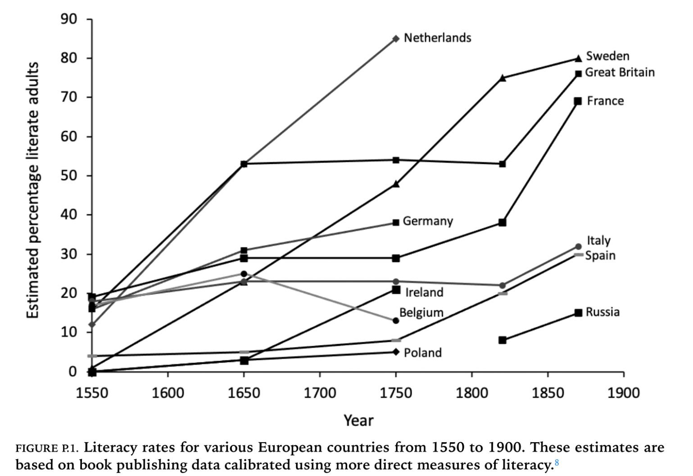

-------------------图片

<div align="center">
  
  <p style="margin: 5px 0; font-size: 14px; color: #666;">222222</p>
</div>

<div align="center">
  
</div>

<div align="center">
  
</div>

-------------------分隔符

<center><strong>*</strong></center>

-------------------橙色强调
 **<span style="color: #E87321;">两边空格</span>** 
**<span style="color: #E87321;"></span>**
-------------------下划线

<u>下划线</u>

-------------------注释 划重点

> **注释**
> 
> [1] 彼得
> [2] David

> **划重点**
> 
> 为了学习本身而：
> 
> 1. 学习；

-------------------

## 问答

泽娜·希兹的《恍惚在思考中》这本书激发了我们的思考

> 我认为人生的最终目的就是追
```
这就涉及到、地位、声望等等等。这些项矛盾，需要取舍。
```

-------------------结尾

<center><strong>（The End）</strong></center>
